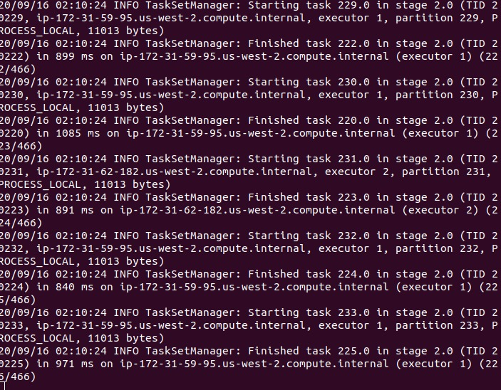
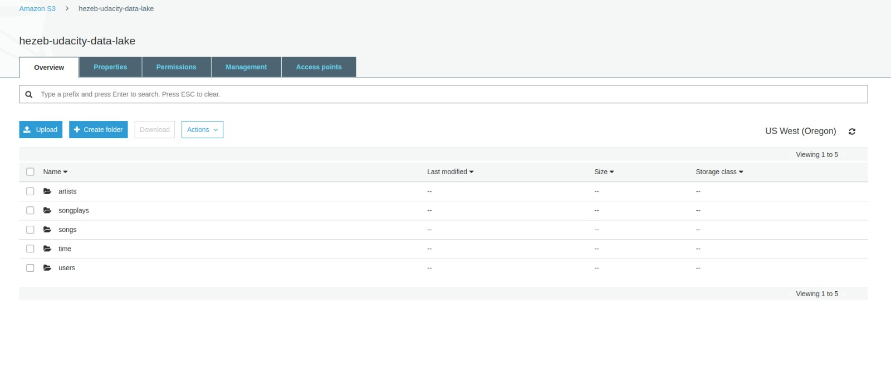

# Udacity DEND Data Lake Project

## Motivation

A music streaming startup, Sparkify, has grown their user base and song database even more and want to move their data warehouse to a data lake. Their data resides in S3, in a directory of JSON logs on user activity on the app, as well as a directory with JSON metadata on the songs in their app.

As their data engineer, I have been tasked with building an ETL pipeline that extracts their data from S3, processes them using Spark, and loads the data back into S3 as a set of dimensional tables. This will allow the analytics team to continue finding insights in what songs their users are listening to.

I will test my database and ETL pipeline by running queries from Sparkify's analytics team and comparing my results with what is expected.

## Skills/technologies being tested

* Knowledge of data lake architecture
* Knowledge of Spark
* Knowledge of AWS systems for implementing data lakes (EMR and S3)
* Knowledge of data modeling and ETL

## The Datasets

I'll be working with two datasets that reside in Udacity's S3 buckets:

    * Song data: s3://udacity-dend/song_data
    * Log data: s3://udacity-dend/log_data

### 1. Song Dataset

This is a subset of real data from the [*Million Song Dataset*](http://millionsongdataset.com/). Each file is in JsON format and contains metadata about a song and the artist of that song. The files are partitioned by the first three letters of each song's track ID. For example, here are filepaths to two files in the dataset

    song_data/A/B/C/TRABCEI128F424C983.json
    song_data/A/A/B/TRAABJL12903CDCF1A.json

### 2. Log Dataset

This dataset consist of log files in JSON format generated by this [*event simulator*](https://github.com/Interana/eventsim) based on the songs in the song dataset above.

The log files are partitioned by year and month. For example, here are filepaths to two files in the dataset.

    log_data/2018/11/2018-11-12-events.json
    log_data/2018/11/2018-11-13-events.json

## Deployment

We will be adopting a cloud-based deployment model for this ETL process, with an EMR cluster for running the ETL job and s3 buckets for holding the output tables

* Set up s3 buckets for the EMR cluster logs and output files
* Run `create_cluster.sh` to create the EMR cluster
* Connect to the EMR cluster master node using the secure shell (ssh) protocol
* Copy the etl.py file to the master node of the EMR cluster using the secure copy (scp) protocol/tool
* Submit the Spark job by running the command below

`spark-submit etl.py --master yarn --deploy-mode client --driver-memory 4g --num-executors 2 --executor-memory 2g --executor-core 2`

If all goes well, the EMR cluster will begin running the ETL job and the master node will continuously output logs to standard out

At the end of the ETL job, we would end up with dimensional tables for Users, Songs, Artists, Songplays and Time as parquet files in the output s3 bucket.

These parquet files can be queried by downstream Spark jobs by the analytics teams.

